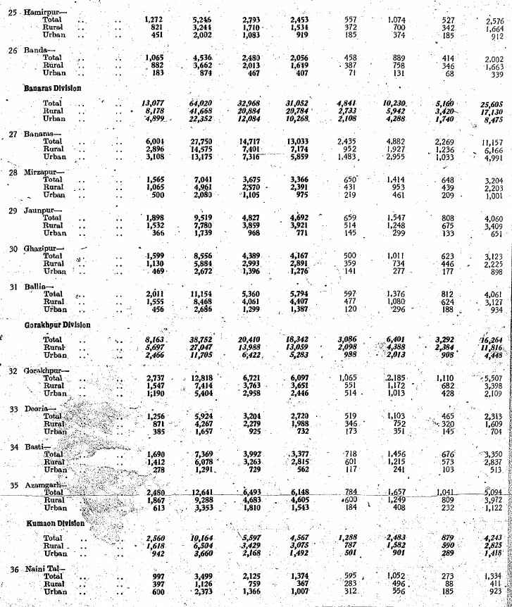
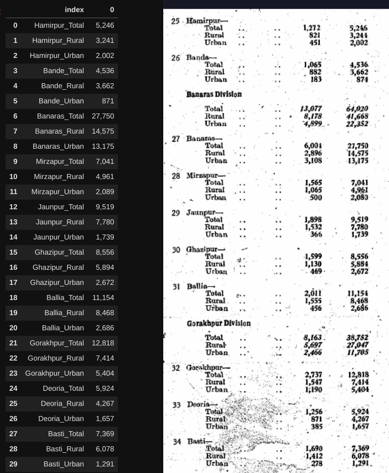

# Minimal example of historical data parsing using [layoutparser](https://layout-parser.github.io/)

[Update Feb 2025]: Ignore everything below, just use gemini. 

---

## Setup

+ Set up google cloud vision API
  + Create a google service account service by following [this](https://cloud.google.com/vision/docs/detect-labels-image-client-libraries#client-libraries-install-python) guide
  + Download a key (should end in `.json`) to a safe location
+ Or set up `tesseract`
  + Follow instructions listed [here](https://github.com/madmaze/pytesseract#installation)

+ create a clean conda/venv environment
+ Install layoutparser using the instructions on [their github](https://github.com/Layout-Parser/layout-parser#installation) ; their website seems out of date

## Input 

Random historical table picked from 1951 UP census

## Processing

`DocParse.ipynb` runs `layoutparser` and extracts lists to produce a
table. Here, we're interested in the 2nd numerical column (which is
population).

## Output 

Some errors, but much preferable to manual entry.

